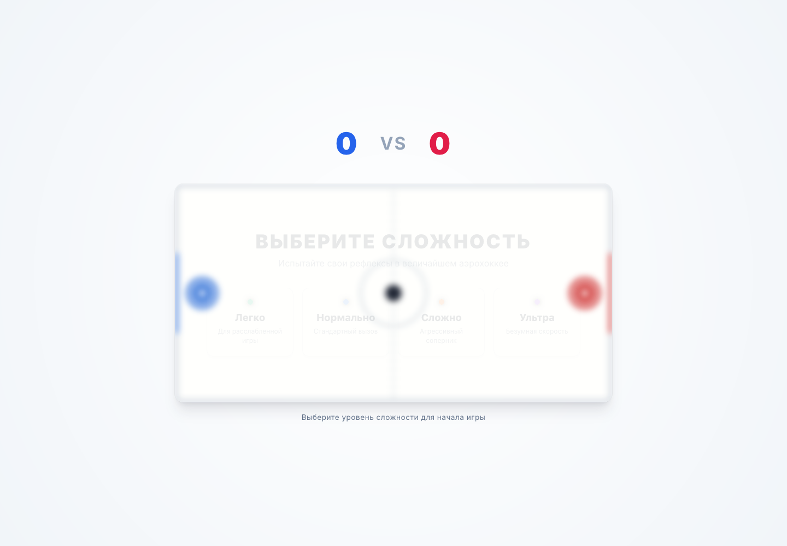
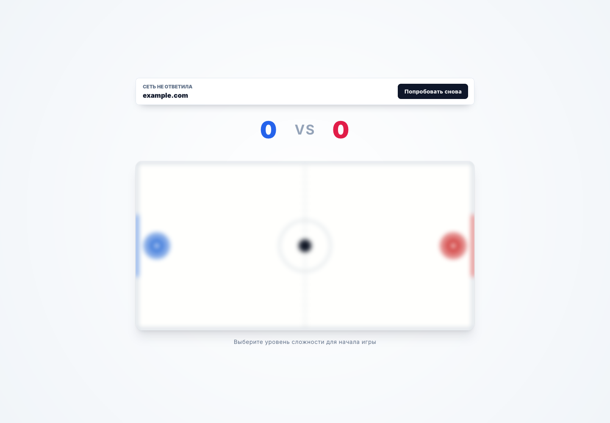

# Greatest Game Offline

Аэрохоккей, который открывается в Firefox, когда интернет решил закончиться.

Я решил полностью отказаться от Windows и перейти на более каноничный open-source путь: Firefox, Linux-way мышление, вот это все. И тут внезапно обнаружилась очень грустная ситуация: когда интернета нет, браузер обычно показывает просто ошибку. Никакого тебе маленького ритуала ожидания, никакой мини-игры, никакой возможности занять руки на пару минут.

А так как проблемы с интернетом в последнее время стали случаться чаще, я решил сделать себе нормальный offline fallback: если страница не загрузилась из-за сетевой ошибки, Firefox открывает локальную страницу расширения с величайшим аэрохоккеем.

## Какая работа с Git была проведена

- Работа велась в отдельной feature-ветке, чтобы не тащить эксперимент с расширением напрямую в `main`.
- Изменения разбивались на небольшие осмысленные коммиты: подготовка React-сборки, оболочка Firefox-расширения, build pipeline, поведение offline fallback.
- Документация была вынесена отдельно, чтобы README не смешивался с функциональной частью.
- Для временного README-черновика использовался `git stash`: это позволило спокойно смержить код расширения, а потом вернуться к документации.
- Функциональная часть проходила через pull request, поэтому перед слиянием было понятно, какие именно изменения попадают в основную ветку.
- В итоге история проекта осталась читаемой: по коммитам видно, что и зачем добавлялось, а не просто один большой архив изменений.

## Как выглядит

Старт игры:



Когда сайт не открылся:



## Что это такое

Greatest Game Offline — это Firefox WebExtension вокруг React-игры.

Расширение слушает ошибки основной навигации через `webRequest.onErrorOccurred`. Если вкладка пыталась открыть обычную `http` или `https` страницу и Firefox получил сетевую ошибку, расширение перенаправляет эту вкладку на локальную страницу:

```text
extension/firefox/game/index.html
```

Игра получает исходный адрес через query-параметр, показывает домен сверху и дает кнопку `Попробовать снова`. Когда интернет вернулся, кнопка отправит вкладку обратно на сайт, который изначально не открылся.

## Установка для локальной разработки

Сначала установите зависимости:

```bash
npm install
```

Соберите игру внутрь папки расширения:

```bash
npm run build:firefox-extension
```

Откройте в Firefox:

```text
about:debugging#/runtime/this-firefox
```

Дальше:

1. Нажмите `Load Temporary Add-on...`.
2. Выберите файл `extension/firefox/manifest.json`.
3. Отключите интернет.
4. Попробуйте открыть любой сайт, например `https://example.com`.

Если Firefox получит сетевую ошибку при загрузке основной страницы, вкладку должно перекинуть на игру.

Важно: для локальной загрузки выбирается именно `extension/firefox/manifest.json`, не zip-архив.

## Упаковка

Собрать zip-архив расширения:

```bash
npm run package:firefox-extension
```

Архив появится здесь:

```text
extension/greatest-game-firefox.zip
```

Он нужен для упаковки и дальнейшего распространения. Для обычного локального теста через `about:debugging` удобнее грузить manifest напрямую.

## Команды

```bash
npm start
```

Запускает React-приложение в dev-режиме.

```bash
npm run build
```

Собирает обычный production build в `build/`.

```bash
npm run build:firefox-extension
```

Собирает React и копирует результат в `extension/firefox/game/`.

```bash
npm run package:firefox-extension
```

Собирает расширение и упаковывает его в zip.

```bash
npm test -- --watchAll=false
```

Запускает тесты один раз.

## Как работает внутри

- `src/components/AirHockey.jsx` — сама игра.
- `extension/firefox/manifest.json` — manifest расширения для Firefox.
- `extension/firefox/background.js` — background-скрипт, который ловит сетевые ошибки и открывает игру.
- `scripts/firefox-extension.js` — build/package pipeline без дополнительных npm-зависимостей.
- `docs/screenshots/` — скриншоты для README.

Технически идея простая: расширение реагирует на сетевую ошибку при открытии страницы и вместо пустого разочарования показывает локально собранную игру. Внутрь игры передается адрес сайта, который не открылся, поэтому сверху есть кнопка `Попробовать снова`. Еще есть базовая защита от повторных редиректов, чтобы расширение вело себя спокойно.

## Ограничения

Это расширение не заменяет встроенную страницу Firefox `about:neterror` напрямую. Оно реагирует на сетевую ошибку основной навигации и после этого перенаправляет вкладку на локальную страницу игры.

Firefox-версия сейчас использует такой формат manifest, который стабильно грузится локально через `about:debugging` и подходит под текущий сценарий с `webRequest`. В детали версий manifest глубоко не ухожу: для этого проекта важнее, чтобы расширение понятно собиралось, запускалось и делало свою работу.
